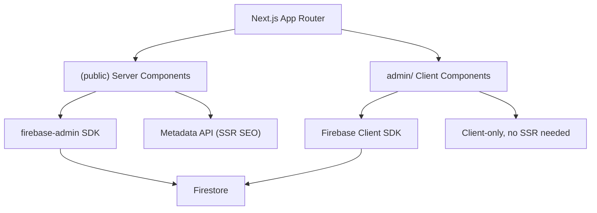

# Next.js Migration — SSR for Public Pages

## Problem

The Vite+React SPA ships an empty `<div id="root"></div>` with blank meta tags. Crawlers see no content. The 8 public pages need server-side rendering.

## Architecture Overview



**Key decisions:**
- **App Router** (not Pages Router) — modern, supports React Server Components
- **Public pages** → Server Components using `firebase-admin` to fetch data at request time
- **Admin pages** → Client Components (`"use client"`) keeping existing Firebase client SDK
- **No `react-router-dom`** — replaced by Next.js file-based routing + `next/link`
- **No `react-helmet-async`** — replaced by Next.js `metadata` API + `generateMetadata()`

> [!IMPORTANT]
> **Prerequisite:** You need a **Firebase service account key** (JSON file) for server-side Firestore access.
> Download it from: Firebase Console → Project Settings → Service Accounts → Generate New Private Key.
> This will be stored as `serviceAccountKey.json` at the project root (gitignored).

---

## Project Structure (After Migration)

```
fitflex-lovable/
├── src/
│   ├── app/                         ← NEW: Next.js App Router
│   │   ├── layout.tsx               ← Root layout (fonts, globals, providers)
│   │   ├── not-found.tsx            ← 404 page
│   │   ├── (public)/                ← Route group (uses PublicLayout)
│   │   │   ├── layout.tsx           ← Navbar + Footer wrapper
│   │   │   ├── page.tsx             ← Home (SSR)
│   │   │   ├── about/page.tsx       ← About (SSR)
│   │   │   ├── classes/page.tsx     ← Classes (SSR)
│   │   │   ├── trainers/page.tsx    ← Trainers (SSR)
│   │   │   ├── blog/page.tsx        ← Blog list (SSR)
│   │   │   ├── blog/[slug]/page.tsx ← Blog detail (SSR)
│   │   │   ├── contact/page.tsx     ← Contact (SSR)
│   │   │   └── [slug]/page.tsx      ← Dynamic CMS pages (SSR)
│   │   ├── login/page.tsx           ← Login (client)
│   │   └── admin/                   ← Admin (all client components)
│   │       ├── layout.tsx           ← AdminLayout + ProtectedRoute
│   │       ├── page.tsx             ← Dashboard
│   │       ├── pages/page.tsx
│   │       ├── blogs/page.tsx
│   │       └── ... (13 more)
│   ├── components/                  ← UNCHANGED (mostly)
│   │   ├── ui/                      ← 49 shadcn components (unchanged)
│   │   ├── public/                  ← Navbar, Footer (Link → next/link)
│   │   └── admin/                   ← AdminSidebar (NavLink → next/link)
│   ├── contexts/                    ← AuthContext (add "use client")
│   ├── hooks/                       ← Unchanged
│   ├── lib/
│   │   ├── firebase.ts              ← Client SDK (unchanged)
│   │   ├── firebase-admin.ts        ← NEW: Server SDK
│   │   ├── firestore.ts             ← Client helpers (unchanged)
│   │   ├── firestore-admin.ts       ← NEW: Server-side fetch helpers
│   │   └── utils.ts                 ← Unchanged
│   └── types/                       ← Unchanged
├── next.config.js                   ← NEW
├── tailwind.config.ts               ← MODIFY (content paths)
├── tsconfig.json                    ← MODIFY (Next.js settings)
└── package.json                     ← MODIFY (deps)
```

---

## Proposed Changes

### Phase 1: Project Setup

#### [NEW] [next.config.js](file:///c:/Users/sadiq/Desktop/Projects/fitflex-lovable/next.config.js)
- Next.js configuration with `src/` directory enabled, image domains for Firebase Storage

#### [MODIFY] [package.json](file:///c:/Users/sadiq/Desktop/Projects/fitflex-lovable/package.json)
- Add: `next`, `firebase-admin`
- Remove: `vite`, `@vitejs/plugin-react-swc`, `react-router-dom`, `react-helmet-async`, `lovable-tagger`
- Update scripts: `dev` → `next dev`, `build` → `next build`, `start` → `next start`

#### [MODIFY] [tsconfig.json](file:///c:/Users/sadiq/Desktop/Projects/fitflex-lovable/tsconfig.json)
- Add Next.js compiler options and `include` paths

#### [MODIFY] [tailwind.config.ts](file:///c:/Users/sadiq/Desktop/Projects/fitflex-lovable/tailwind.config.ts)
- Update `content` array to include `src/app/**/*.{ts,tsx}`

#### [DELETE] [vite.config.ts](file:///c:/Users/sadiq/Desktop/Projects/fitflex-lovable/vite.config.ts)
#### [DELETE] [index.html](file:///c:/Users/sadiq/Desktop/Projects/fitflex-lovable/index.html)
#### [DELETE] [src/main.tsx](file:///c:/Users/sadiq/Desktop/Projects/fitflex-lovable/src/main.tsx)
#### [DELETE] [src/App.tsx](file:///c:/Users/sadiq/Desktop/Projects/fitflex-lovable/src/App.tsx)
#### [DELETE] [vite-env.d.ts](file:///c:/Users/sadiq/Desktop/Projects/fitflex-lovable/src/vite-env.d.ts)

---

### Phase 2: Firebase Admin SDK

#### [NEW] [firebase-admin.ts](file:///c:/Users/sadiq/Desktop/Projects/fitflex-lovable/src/lib/firebase-admin.ts)
- Initialize `firebase-admin` with service account key
- Export `adminDb` (admin Firestore instance)

#### [NEW] [firestore-admin.ts](file:///c:/Users/sadiq/Desktop/Projects/fitflex-lovable/src/lib/firestore-admin.ts)
- Server-side equivalents of `getCollection` and `getDocument` using `firebase-admin`
- Used by all Server Components for data fetching

---

### Phase 3: App Router Layouts

#### [NEW] [src/app/layout.tsx](file:///c:/Users/sadiq/Desktop/Projects/fitflex-lovable/src/app/layout.tsx)
- Root layout: imports global CSS, Google Fonts, QueryClientProvider, AuthProvider, Toaster/Sonner
- Wraps `{children}` with client-side providers via a `Providers` client component

#### [NEW] [src/app/(public)/layout.tsx](file:///c:/Users/sadiq/Desktop/Projects/fitflex-lovable/src/app/(public)/layout.tsx)
- Public layout: Navbar + Footer + DynamicThemeProvider + ScriptInjector
- Replaces `PublicLayout.tsx` (which uses `Outlet` from react-router-dom)

#### [NEW] [src/app/admin/layout.tsx](file:///c:/Users/sadiq/Desktop/Projects/fitflex-lovable/src/app/admin/layout.tsx)
- Admin layout with ProtectedRoute wrapper + SidebarProvider + AdminSidebar
- Replaces `AdminLayout.tsx`

---

### Phase 4: Public Pages (Server Components — SSR)

Each page converted from client-side `useEffect` + Firestore to an **async Server Component** that fetches data directly using `firebase-admin`. SEO metadata is exported via `generateMetadata()`.

#### [NEW] [src/app/(public)/page.tsx](file:///c:/Users/sadiq/Desktop/Projects/fitflex-lovable/src/app/(public)/page.tsx) — Home
#### [NEW] [src/app/(public)/about/page.tsx](file:///c:/Users/sadiq/Desktop/Projects/fitflex-lovable/src/app/(public)/about/page.tsx)
#### [NEW] [src/app/(public)/classes/page.tsx](file:///c:/Users/sadiq/Desktop/Projects/fitflex-lovable/src/app/(public)/classes/page.tsx)
#### [NEW] [src/app/(public)/trainers/page.tsx](file:///c:/Users/sadiq/Desktop/Projects/fitflex-lovable/src/app/(public)/trainers/page.tsx)
#### [NEW] [src/app/(public)/blog/page.tsx](file:///c:/Users/sadiq/Desktop/Projects/fitflex-lovable/src/app/(public)/blog/page.tsx)
#### [NEW] [src/app/(public)/blog/[slug]/page.tsx](file:///c:/Users/sadiq/Desktop/Projects/fitflex-lovable/src/app/(public)/blog/[slug]/page.tsx)
#### [NEW] [src/app/(public)/contact/page.tsx](file:///c:/Users/sadiq/Desktop/Projects/fitflex-lovable/src/app/(public)/contact/page.tsx)
#### [NEW] [src/app/(public)/[slug]/page.tsx](file:///c:/Users/sadiq/Desktop/Projects/fitflex-lovable/src/app/(public)/[slug]/page.tsx) — Dynamic CMS pages

Each page will have:
- `generateMetadata()` — fetches SEO settings + page-specific metadata from Firestore
- Default export — async Server Component that fetches data and renders HTML
- Interactive parts extracted to Client Components where needed (e.g., category filter on Classes page)

---

### Phase 5: Admin Pages (Client Components)

Each admin page gets a thin wrapper:

```tsx
// src/app/admin/pages/page.tsx
"use client";
export { default } from "@/pages/admin/PagesAdmin";
```

This re-exports the existing admin page component unchanged. The existing admin pages in `src/pages/admin/` just need:
- `"use client"` directive added at the top
- `Link` / `useNavigate` from `react-router-dom` → `Link` / `useRouter` from `next/link` / `next/navigation`

---

### Phase 6: Component Updates

#### [MODIFY] [Navbar.tsx](file:///c:/Users/sadiq/Desktop/Projects/fitflex-lovable/src/components/public/Navbar.tsx)
- Add `"use client"` (uses `useState`, `useEffect`, event listeners)
- `Link` from `react-router-dom` → `Link` from `next/link` (`to` → `href`)
- `useLocation` → `usePathname` from `next/navigation`

#### [MODIFY] [Footer.tsx](file:///c:/Users/sadiq/Desktop/Projects/fitflex-lovable/src/components/public/Footer.tsx)
- Same changes as Navbar

#### [MODIFY] [AdminSidebar.tsx](file:///c:/Users/sadiq/Desktop/Projects/fitflex-lovable/src/components/admin/AdminSidebar.tsx)
- Add `"use client"`, same Link/useLocation swaps

#### [MODIFY] [NavLink.tsx](file:///c:/Users/sadiq/Desktop/Projects/fitflex-lovable/src/components/NavLink.tsx)
- Convert to use `next/link` instead of `react-router-dom`

#### [MODIFY] [ProtectedRoute.tsx](file:///c:/Users/sadiq/Desktop/Projects/fitflex-lovable/src/components/ProtectedRoute.tsx)
- `Navigate` → `redirect()` from `next/navigation`

#### [DELETE] [RedirectHandler.tsx](file:///c:/Users/sadiq/Desktop/Projects/fitflex-lovable/src/components/RedirectHandler.tsx)
- Replaced by Next.js `redirects` in `next.config.js` or middleware

#### [DELETE] [SEOHead.tsx](file:///c:/Users/sadiq/Desktop/Projects/fitflex-lovable/src/components/SEOHead.tsx)
- Replaced by `generateMetadata()` in each page

#### [MODIFY] [ScriptInjector.tsx](file:///c:/Users/sadiq/Desktop/Projects/fitflex-lovable/src/components/ScriptInjector.tsx)
- Remove `react-helmet-async` usage, use direct DOM manipulation only
- Add `"use client"`

#### [MODIFY] [DynamicThemeProvider.tsx](file:///c:/Users/sadiq/Desktop/Projects/fitflex-lovable/src/components/DynamicThemeProvider.tsx)
- Add `"use client"` (already client-only logic)

#### [MODIFY] [AuthContext.tsx](file:///c:/Users/sadiq/Desktop/Projects/fitflex-lovable/src/contexts/AuthContext.tsx)
- Add `"use client"` at top

---

### Phase 7: Redirects via Middleware

#### [NEW] [src/middleware.ts](file:///c:/Users/sadiq/Desktop/Projects/fitflex-lovable/src/middleware.ts)
- Replaces `RedirectHandler` — fetches redirects from Firestore and handles them at the edge
- Alternatively, configure static redirects in `next.config.js`

---

## Verification Plan

### Build & Dev
1. Run `npm run dev` — verify all public and admin pages load
2. Run `npm run build` — verify build succeeds without errors

### SSR Verification
1. `curl http://localhost:3000/` — verify HTML contains full page content, populated meta tags
2. `curl http://localhost:3000/blog` — verify blog list HTML is server-rendered
3. `curl http://localhost:3000/about` — verify About content in HTML
4. Check "View Page Source" in browser for each public page — should see full content

### Functional Testing
1. Navigate through all public pages — verify content loads correctly
2. Login to admin → verify all admin CRUD operations still work
3. Test dynamic CMS pages and blog detail pages
4. Verify theme provider, script injector, and redirects work
